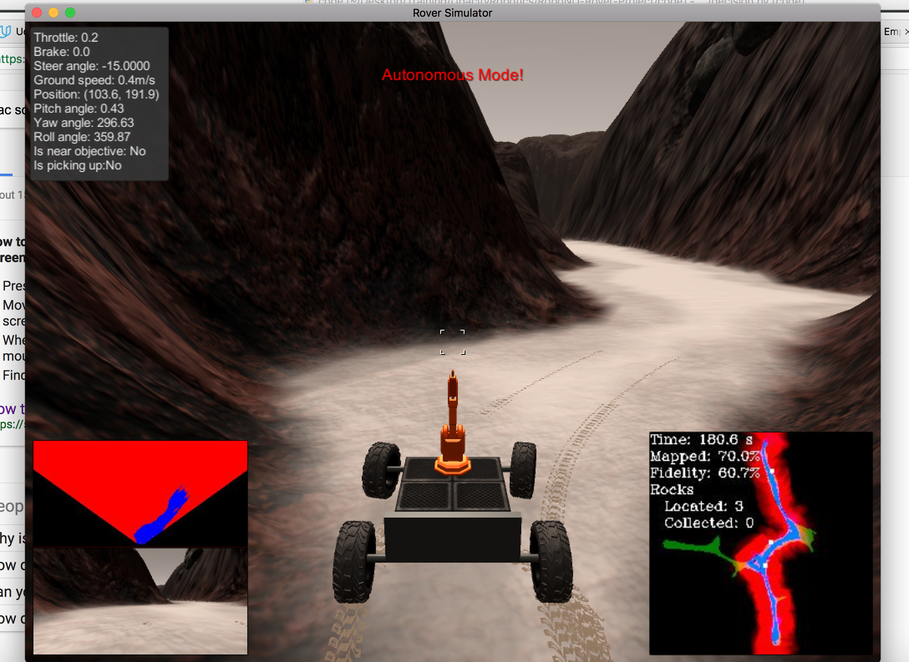
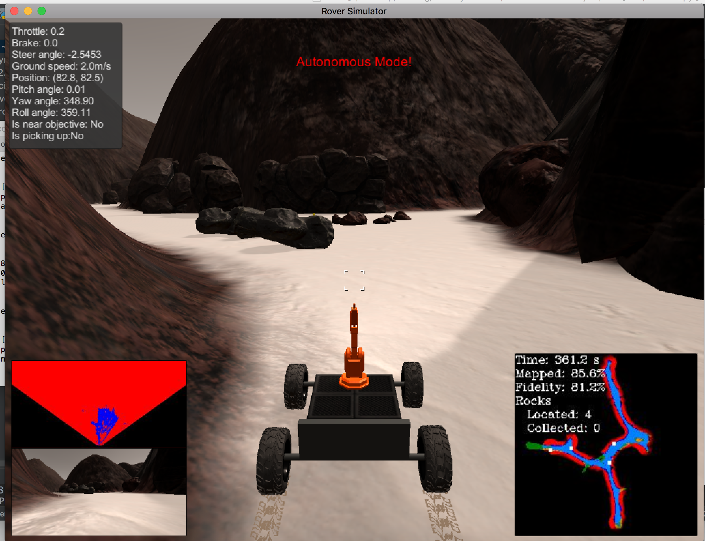

### Writeup / README

### Notebook Analysis
#### 1. Run the functions provided in the notebook on test images (first with the test data provided, next on data you have recorded). Add/modify functions to allow for color selection of obstacles and rock samples.

I essentially used the notebook on a few snapshots in order to play with calibrations of the filter cutoff. Although there are technically 3 settings, there are really only two that we have to find: Navigable terrain and the rocks. Obstacles are the complement of the navigable terrain map. Using the google color picker, I decided that navigable terrain was acceptable as greyer versions of pure white which is (255,255,255) in standard rgb values. With trial and error, I found that values between (160,160,160) and (175,175,175) function well as the threshold.

However, it is important to note that the terrain has different levels of lighting. If the cutoff is threshold, i.e. (120,120,120) to include different shades of grey, the rover drives much better and is more capable of detecting navigable terrain, but the mapping fidelity is lowered. Thus there is a tradeoff between mapping fidelity and % of map explored, modulated by the cutoff levels. I renamed color_thresh to find_ground(). In the same vein, I added an additional function find_walls() that provides the complement of the terrain. 

To detect rocks, it's observable from the simulation that rocks are colored dull yellow-brown, almost an ochre color. This color is found to be about (110,110,50) and can include those colors with b below 50 with the color mixer [here](https://www.w3schools.com/colors/colors_converter.asp), to account for shadows. This is a different task than the normal color thresholding, so I wrote another function, find_rocks() to do the thresholding. 

#### 1. Populate the `process_image()` function with the appropriate analysis steps to map pixels identifying navigable terrain, obstacles and rock samples into a worldmap.  Run `process_image()` on your test data using the `moviepy` functions provided to create video output of your result. 

The process_image() function was edited to include a new function, update_worldmap() that cycles through the thresholds and terrain_finding functions. These then update to the appropriate slice of the Rover.worldmap. The explored terrain is automatically rendered as pink area on the video.

### Autonomous Navigation and Mapping

#### 1. Fill in the `perception_step()` (at the bottom of the `perception.py` script) and `decision_step()` (in `decision.py`) functions in the autonomous mapping scripts and an explanation is provided in the writeup of how and why these functions were modified as they were.

I took the boilerplate code provided in the walkthrough and refactored it so that the meanings of the functions and decision trees were clearer. I also included different constants for mapping so that visualized terrain and obstacles were marked differently (this is outlined in the walkthrough). I partially did this in preparation for fully completing the project.

#### 2. Launching in autonomous mode your rover can navigate and map autonomously.  Explain your results and how you might improve them in your writeup.  

Due to technical troubles getting the project setup, and running weeks behind, Ioriginally submitted the project without any special AI. Using the default search method, wander_strategy(), and a threshold for navigable terrain (175,175,175), the rover wanders toward the center of its detected navigable terrain unless executing the escape_obstacle_strategy(). This enables the rover to map 70.1% of the terrain at 60.7% fidelity after about 3 minutes. It finds only a few of the rocks in this simulation. The rover does not pick up rocks, although it faithfully maps several of them. Lowering the terrain threshold to (160,160,160) or even lower to (120,120,120) allows the rover to accurately and quickly traverse up to 98% of the map and find every rock, although the fidelity drops below 50% pretty quickly. 

**Resubmission:**

After the above results, I went back and wrote a more complex algorithm that focuses on hugging the left walls and trying to follow the wall left at all times. This is achieved by changing the steering method from calculating the mean of all visible angles to one that calculates the mean of only the left angles (the code can be easily switched to right side walls). This is done with the steer_for_wall() and crush_angles_left() functions. In addition to this, and equally important, I added an improved color_thresh() method that includes both upper and lower bounds. This enables the ability to filter out bright sands on the terrain map, using an upper threshold of (235,235,235). The bright sands in the distance seem to confound the standard path setting method. By using this upper threshold we can see that only local, meaningful angles are perceived by the rover. I also added functions that enable the rover to consider different state changes and return to previous states. This gives it some memory and enables a very effective .attempt_escape() method.

In addition to these improvements, I added a smooth_steering method that averages new steering inputs with the previous 5 changes. This averages out crazy steering changes. (other settings are possible) This is a blunt tool, and I imagine other ideas are possible, for example building up a histogram of inputs and then using a simulated circuit that looks for discontinuities in the steering input, and averages the inputs out before outputting to the steering. This strategy easily completes over 80% of the mapping with over 80% fidelity.

A passive rock-retrieval strategy is in place. It only works if the rover is in a clear line-of-sight to the rock and a short distance away. Due to the structure of the arena, this rarely happens and is not something that can be counted upon.

Improvements that can be made:

1) Upgrades to the wall-following strategy. The wall-following strategy could still benefit from some additional tuning. The crush_angles_method might be improved by considering percentiles of angles, and also filtering out or averaging out nonsense steering angles when they happen, i.e. suddenly steering to -15 when the last 20 steering inputs have a mean of 5. In general this is a problem that could be solved with the above idea of looking for extreme changes in behavior in a single process variable (i.e. steering input).

2) An exploring strategy - this would following something like a flood search strategy that would enable the rover to exhaustively explore the area near it using the already implied world grid. Given my understanding of the "fidelity" metric, it is likely such a strategy would imperil the goals of the project

3) An active rather than passive rock-retrieval strategy - this would stop the rover, target a rock in terms of its grid location, plot a direction towards a rock, drive to it, and pick it up. Such a method would require some sort of plotting, memory-based method akin to the above grid concept. I have implemented basic attributes to the rover state class to be able to achieve these goals. 

I wish that other sensor data was available other than a camera.

